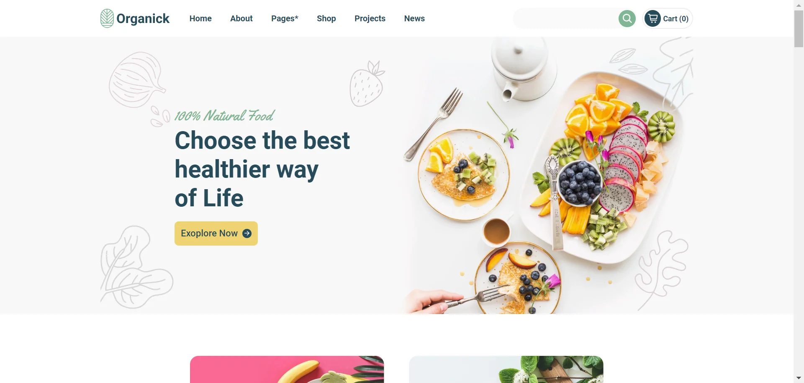

# 🌿 Organick

### :page_facing_up: About

Organic Agricultural Products Online Shop Landing Page This is a **fully responsive** landing page for an online shop that sells organic agricultural products. The page was developed using **HTML**, **Sass**, and **JavaScript**. This page was developed based on a Figma design that you can see [**Here**](https://www.figma.com/community/file/1202913967893500741) which was not responsive and I made it responsive by myself.

### :star2: Features

- Fully responsive design

- Built with HTML, Sass, and JavaScript

### :clapper: Live Demo
You can view a live demo of this project **[Here](https://organick-wrry.netlify.app/)** 
➡️ To load faster please connect your VPN and then see the live demo.

### :computer: Installation

1. Clone the repository. `git clone https://github.com/weryamajidi/Organick`

2. In the terminal run `npm install` to install all dependencies. 

:writing_hand: P.S.: For commits, I've used **gitmoji**. For a better understanding use case of the **gitmoji** see [**Here**](https://github.com/carloscuesta/gitmoji)
